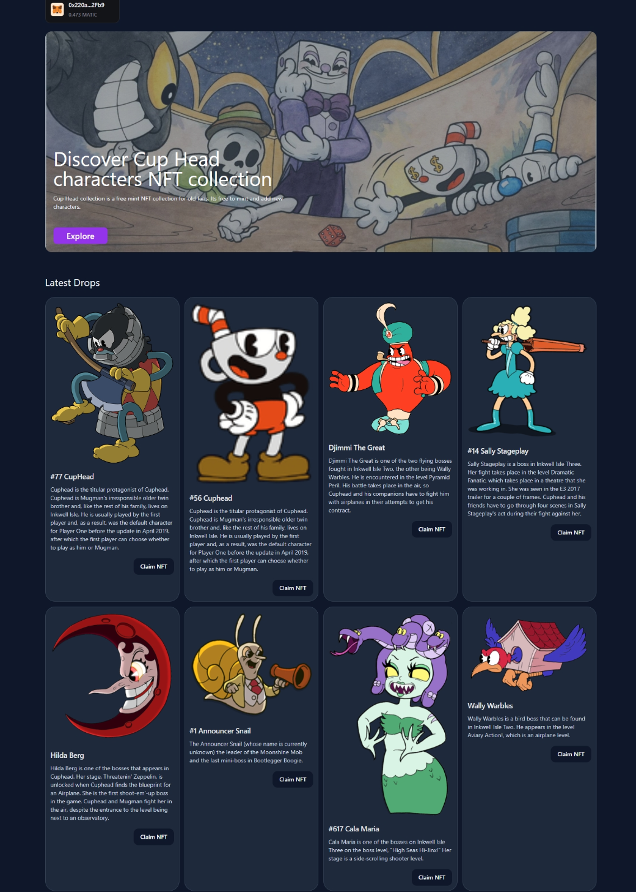

# 🥤CupHead NFT Minter DAPP

A unique NFT collection celebrating the iconic art style and characters of the beloved run-and-gun video game Cuphead.

## :space_invader:About the Collection

The Cuphead NFT collection showcases the game's stunning character designs, memorable backgrounds and moments that have made Cuphead such a beloved experience. Whether you're a fan of video games, animation or art, this collection is sure to captivate and inspire.

It serves as a testament to the creative genius behind the game and a celebration of its timeless appeal. Each NFT captures the charming retro aesthetic and attention to detail that fans have come to love.

**You can view a live demo** :point_right: [here](https://youtu.be/RCL1IUqV5FI).

The collection aims to capture the charm and creativity of Cuphead while bringing utility to fans new and old. Join the adventure today!

## :dizzy: Features

- Responsive design that adapts to any screen size
- Customizable links, colors, and styles
- Upload and Mint NFT's Directly inside dApp
- Connect Wallet Button to Transact with Mumbai Testnet
- Cuphead-inspired art deco interface

## :desktop_computer: Tech Stack

- ThirdWeb
- NFT.Storage
- Vite
- Shadcn UI
- TailwindCSS
- React

## :building_construction: Future Improvements

- Add light mode support.
- Tidy up NFT Card Components for Better UI.
- Add animations and transitions.
- Package as a reusable component.
